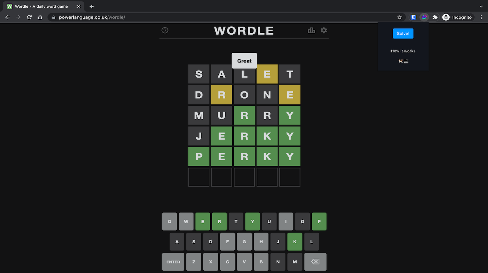

# Wordle Solver - Chrome Extension



Chrome extension that solves daily wordle problem using solution outlined on [Alex Selby's page](http://sonorouschocolate.com/notes/index.php?title=The_best_strategies_for_Wordle)

Currently only supports Normal mode

## Run locally

```
git clone https://github.com/NasirKhalid24/wordle-bot.git
cd wordle-bot
npm i
npm start
```

To load extension in chrome:

1. Access `chrome://extensions/`
2. Check `Developer mode`
3. Click on `Load unpacked extension`
4. Select the `build` folder.

## To Do

- Support hard mode
- Solve mid way
